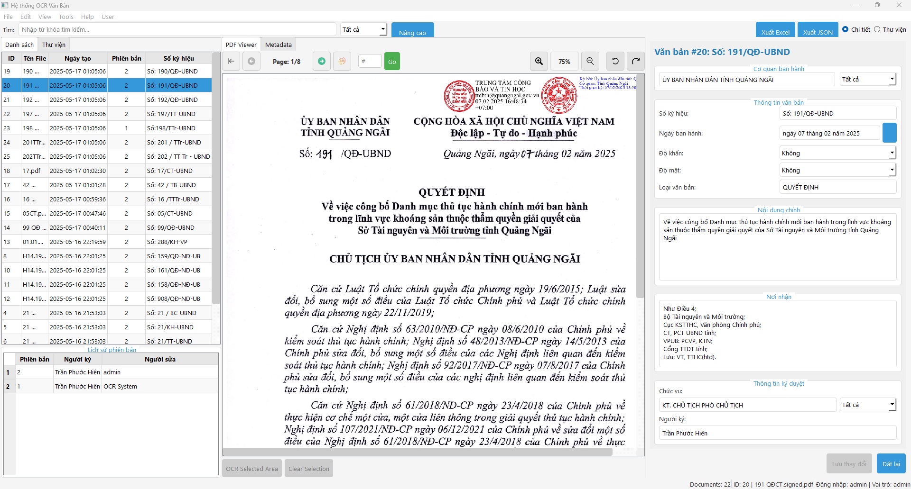

# OCR_LOCAL_VBHC - Hệ thống OCR Văn Bản Hành Chính

[](LICENSE)
[](https://www.python.org/)
[](https://pypi.org/project/PyQt5/)

Hệ thống OCR Văn Bản Hành Chính (OCR_LOCAL_VBHC) là một ứng dụng desktop hiện đại giúp quản lý và trích xuất thông tin từ văn bản hành chính. Sử dụng công nghệ OCR tiên tiến và mô hình AI, hệ thống có khả năng nhận dạng và phân loại các thành phần cấu trúc trong văn bản hành chính tiếng Việt như: cơ quan ban hành, số ký hiệu, ngày ban hành, độ khẩn, nội dung chính, nơi nhận, và nhiều yếu tố khác.



## Demo

### Video Demo

Xem video demo tại: [Google Drive](https://drive.google.com/file/d/1AG2m2H5GhyX_I6Mcw7zgVK8h-HYZJOjN/view?usp=sharing)

Hoặc xem video demo trực tiếp từ repository:

https://github.com/QuangDuyxyz/OCR_LOCAL_VBHC/blob/main/Images/demo.mp4

## Tính năng chính

### 1. OCR và Trích xuất thông tin văn bản
- **Nhận dạng văn bản tự động** với độ chính xác cao
- **Trích xuất thông tin có cấu trúc** từ văn bản hành chính:
  - Cơ quan ban hành (CQBH)
  - Số ký hiệu
  - Ngày ban hành
  - Độ khẩn / Độ mật
  - Loại văn bản
  - Nội dung chính
  - Nơi nhận
  - Chức vụ và Chữ ký
- **Xử lý ảnh nâng cao** tối ưu cho văn bản tiếng Việt có dấu
- **Xử lý hàng loạt** nhiều tài liệu cùng lúc
- **Vẽ vùng chọn OCR** cho vùng cụ thể trên tài liệu

### 2. Quản lý tài liệu
- **Xem PDF tích hợp** với các chức năng phóng to, thu nhỏ, xoay
- **Quản lý phiên bản** theo dõi các phiên bản tài liệu
- **Tìm kiếm** tài liệu theo nhiều tiêu chí
- **Đánh thẻ (Tags)** phân loại tài liệu
- **Sao lưu tự động** và khôi phục dữ liệu

### 3. Xuất và phân tích dữ liệu
- **Xuất Excel và JSON** có định dạng chuyên nghiệp
- **Báo cáo thống kê** tổng hợp dữ liệu
- **Phân tích xu hướng** theo thời gian và loại văn bản

### 4. Bảo mật và người dùng
- **Đăng nhập & Đăng ký** hệ thống quản lý người dùng
- **Phân quyền** Admin/User
- **Hệ thống giấy phép** quản lý license
- **Nhật ký hoạt động** ghi lại thao tác người dùng

### 5. Giao diện người dùng
- **Giao diện hiện đại** dựa trên PyQt5
- **Chế độ xem đa dạng** (chi tiết, thư viện)
- **Chủ đề sáng/tối** tùy chỉnh theo sở thích
- **Gợi ý tự động** cho thông tin đã nhập trước đó

## Vẽ hộp thủ công

### Mục đích
Tính năng này cho phép người dùng vẽ hộp thủ công trên trang tài liệu để chọn vùng cụ thể cho OCR, thay thế cho tính năng phát hiện YOLO tự động.

### Cách sử dụng
1. Mở một tài liệu
2. Nhấp vào nút "Vẽ hộp" trong thanh công cụ để vào chế độ vẽ
3. Nhấp và kéo trên tài liệu để vẽ hộp xung quanh vùng văn bản
4. Khi bạn thả nút chuột, một hộp thoại sẽ xuất hiện
5. Chọn lớp (loại nội dung) cho vùng đã chọn
6. Nhấp "OK" để xử lý vùng đã chọn với OCR
7. Văn bản trích xuất sẽ được đặt vào trường tương ứng trong trình chỉnh sửa metadata

### Tính năng
- Chọn vùng chính xác khi phát hiện YOLO không chính xác
- Hoạt động với mọi mức thu phóng và vị trí cuộn
- Bảo toàn tọa độ chính xác giữa hiển thị và hình ảnh gốc
- Hộp thủ công được hiển thị màu đỏ (hộp YOLO tự động màu vàng)
- Mỗi hộp thủ công được liên kết với một lớp cụ thể (Số ký hiệu, Cơ quan ban hành, v.v.)

## Yêu cầu hệ thống

### Phần cứng
- CPU: Intel Core i5 hoặc cao hơn
- RAM: 8GB tối thiểu (khuyến nghị 16GB)
- GPU: NVIDIA GPU có CUDA (khuyến nghị cho tốc độ OCR nhanh)
- Ổ cứng: 5GB dung lượng trống

### Phần mềm
- Windows 10/11 (64-bit)
- Python 3.8+
- Các thư viện cần thiết (xem `requirements.txt`)

## Cài đặt

### 1. Clone repository

```bash
git clone https://github.com/QuangDuyxyz/OCR_LOCAL_VBHC.git
cd OCR_LOCAL_VBHC
```

### 2. Cài đặt các gói phụ thuộc

```bash
pip install -r requirements.txt
```

### 3. Tải mô hình YOLO

Tải mô hình YOLO và đặt vào thư mục `models/best.pt`

### 4. Chạy ứng dụng

```bash
python main.py
```

## Requirements

```
PyQt5==5.15.9
pdf2image==1.16.3
PyMuPDF==1.23.5
opencv-python==4.8.1
numpy==1.24.4
pandas==2.0.3
ultralytics==8.0.196
google-generativeai==0.3.1
tqdm==4.66.1
openpyxl==3.1.2
sqlite3==3.35.0
Pillow==10.0.0
```

## Hướng dẫn sử dụng

1. **Đăng nhập hệ thống**
   - Sử dụng tài khoản mặc định: `admin / admin123` hoặc đăng ký mới

2. **Nhập văn bản**
   - Nhấn "Thêm tệp" để chọn file PDF cần OCR
   - Hệ thống sẽ tự động xử lý và trích xuất thông tin

3. **Chỉnh sửa kết quả OCR**
   - Kiểm tra và chỉnh sửa các trường thông tin đã trích xuất
   - Nhấn "Lưu" để cập nhật thông tin

4. **Quản lý tài liệu**
   - Chuyển đổi giữa chế độ xem chi tiết và thư viện
   - Tìm kiếm và lọc tài liệu theo nhu cầu

5. **Xuất dữ liệu**
   - Sử dụng nút "Xuất Excel" hoặc "Xuất JSON" để xuất dữ liệu

## Liên hệ và hỗ trợ

Nếu bạn có bất kỳ câu hỏi hoặc gặp vấn đề, vui lòng tạo issue trên GitHub hoặc liên hệ trực tiếp qua:

- GitHub: [QuangDuyxyz](https://github.com/QuangDuyxyz)
- Email: nguyenngoduydmx@gmail.com

## Giấy phép

Dự án này được phân phối dưới giấy phép MIT. Xem file `LICENSE` để biết thêm chi tiết.